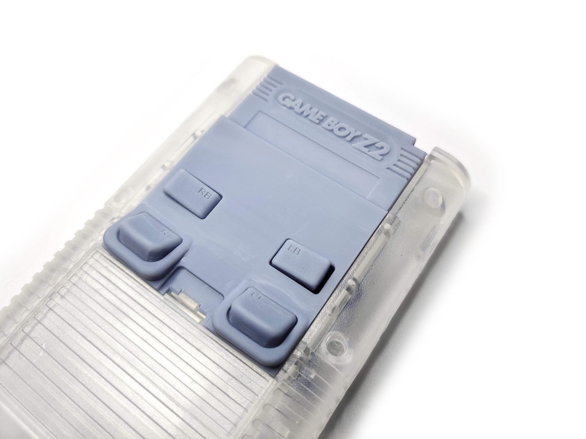

# Game-Boy-Z2
Game Boy Zero Rear Button Housing

I created this design to add comfortable shoulder and trigger buttons to my Kite’s Circuit Sword Game Boy Zero build.

You can have the PCBs and Shell made at your favorite fabricator like JLCPCB or PCBway. This project is provided as-is, so please do the required research for having the PCB button board and shell files made.

Follow the [Build Guide](https://www.humblebazooka.com/2021/01/18/how-to-install-our-gameboy-zero-z2-back-button-bracket/) for all other information.
